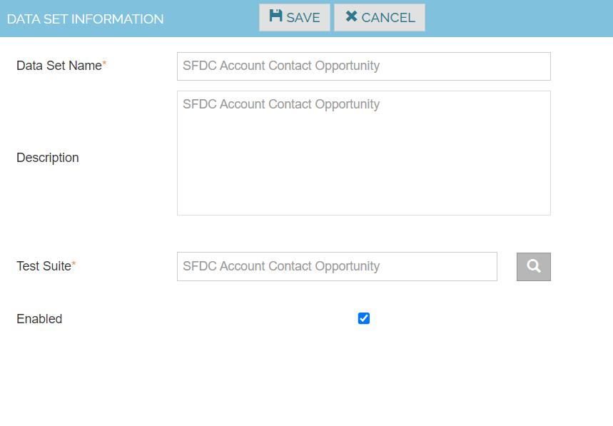
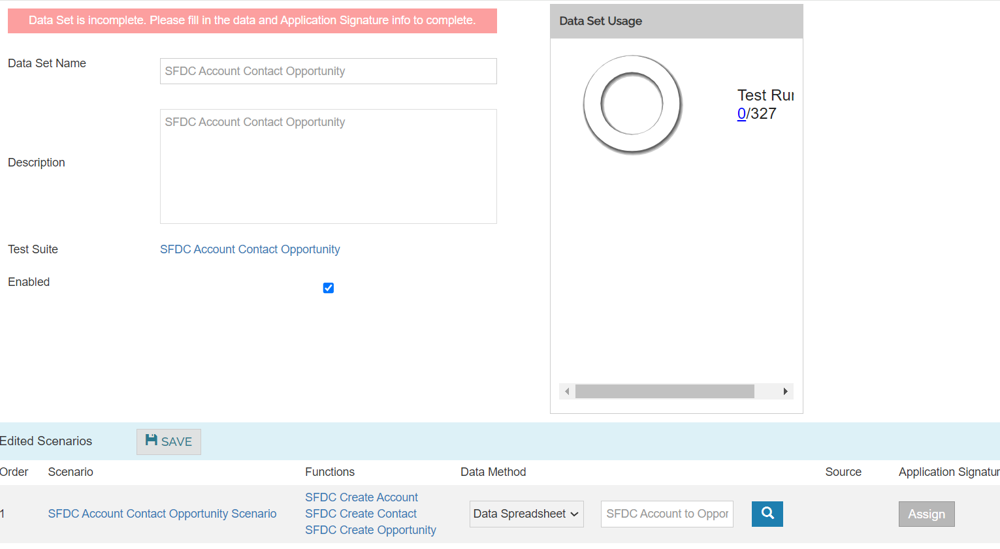
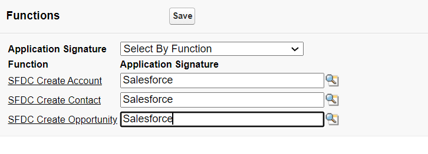
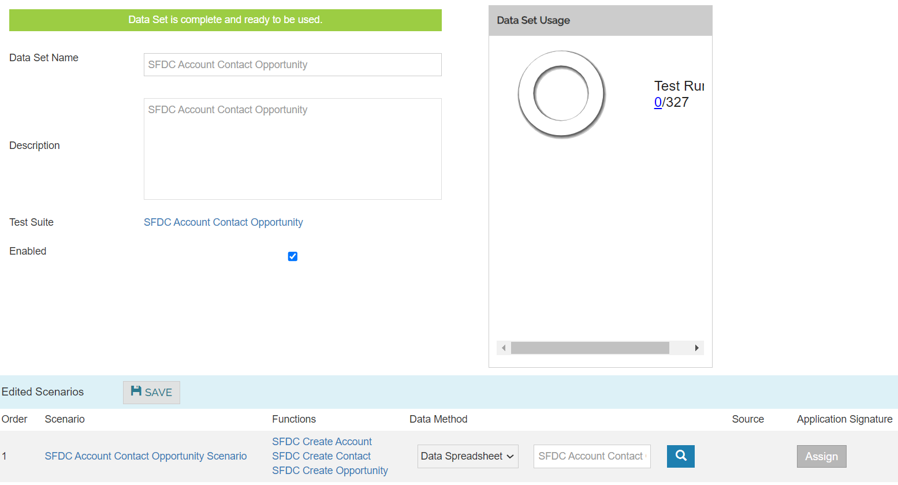

Data Sets

Create Datasets for each Test suite

1. Navigate to Data -> Datasets 
2. Click on Create New Data Set
3. Enter the Dataset name , description and testsuite name
4. Click on Save button

|Data Set Name |	SFDC Create Account Contact and Opportunity |
|--------------|------------------------------------------------|
|Description   |	SFDC Create Account Contact and Opportunity |
|Test Suite	   |    SFDC Create Account Contact and Opportunity |

Assign Data Spreadsheet (SFDC Create Account, Contact and Opportunity Datasheet) and click Assign button.

Click Application Signature LOV and choose “Salesforce”. Click Save button.

Click on save button
After performing the save action, the “Data Set is complete and ready to be used” shown and highlighted in green.

After the above steps are completed, we are going to perform the following steps such as create project, test cycle, test run which can be created and executed
