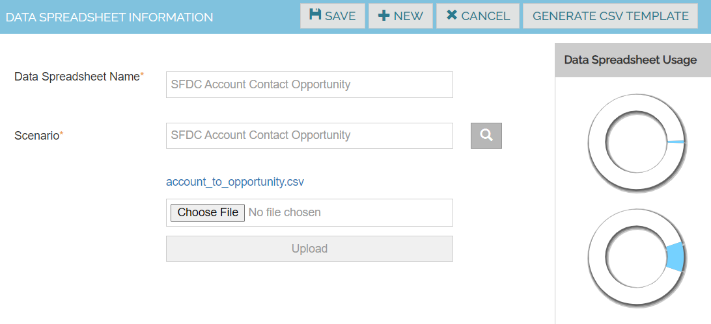
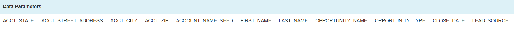

Spreadsheets

Create spreadsheets containing data corresponding to each one of the scenarios to be tested.

1. Navigate to Data -> Spreadsheets 
2. Click on Create New Data Spreadsheet
3. Enter the Data spreadsheet name and scenario name
4. Click on save button

| Data Spreadsheet Name | 	SFDC Create Account Contact and Opportunity |
|---------------------- |----------------------------------------------- |
| Scenario	            |   SFDC Create Account Contact and Opportunity |
| File	                | Browse and upload the CSV file                 |

Note: If you need sample CSV file, Click on Generate CSV Template button and get the file

