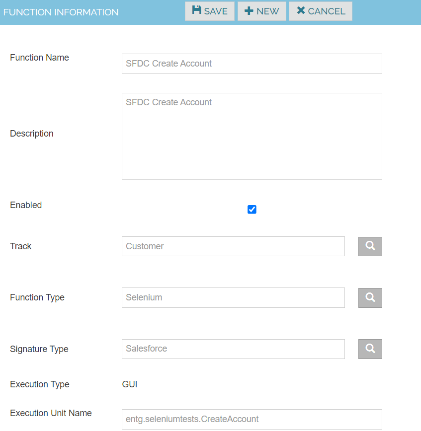
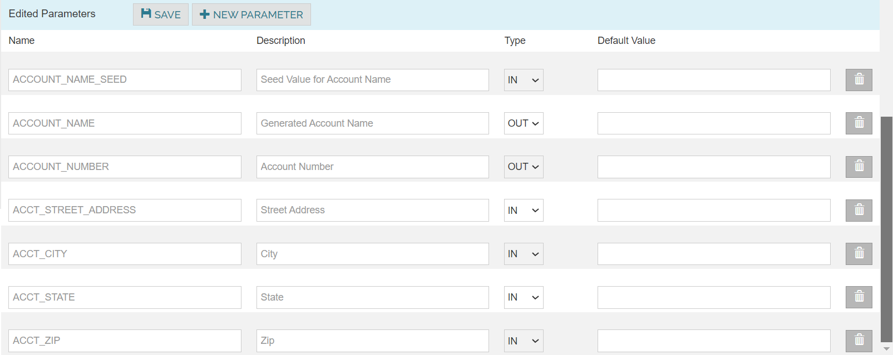

Funcitons
 
Create Test Functions with their parameters corresponding to each functionality to be tested within the application.

1. Navigate to Configuration -> Functions
2. Click on Create New Function
3. Enter the Function Name , Description and the details as given below.
4. Click on Save.

| Function Name      | SFDC Create Account |
| --------           | -------             |
| Description        | SFDC Create Account |
| Track              | Account             |
| Function Type      | Selenium            |
| Signature Type     | Salesforce          |
| Execution Type     | GUI                 |
| Execution Unit Name| CreateAccount       |

Click New Parameter button and enter the below details. Save the Work.

| Name                | Description          | Type |
|---------------------|----------------------|------|
| ACCOUNT_NAME_SEED   | Account_Name_Seed    | IN   |
| ACCOUNT_NAME        | Account_Name         | OUT  |
| ACCOUNT_NUMBER      | Account_Number       | OUT  |
| ACCT_STREET_ADDRESS | Acct_Street_Address  | IN   |
| ACCT_CITY           | Acct_City            | IN   |
| ACCT_STATE          | Acct_State           | IN   |
| ACCT_ZIP            | Acct_Zip             | IN   |

Note : Follow the above steps and create functions for SFDC Create Opportunity and SFDC Create Contact

 
