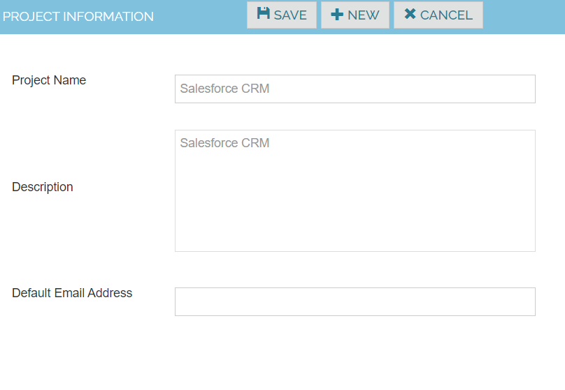

Project

Create Projects corresponding to the projects to be tested.

1. Navigate to Administer -> Projects 
2. Click on Create New Project 
3. Enter the Project name and description
4. Click on save button

| Project Name	| Salesforce CRM |
|---------------|----------------|
| Description	| Salesforce CRM |

