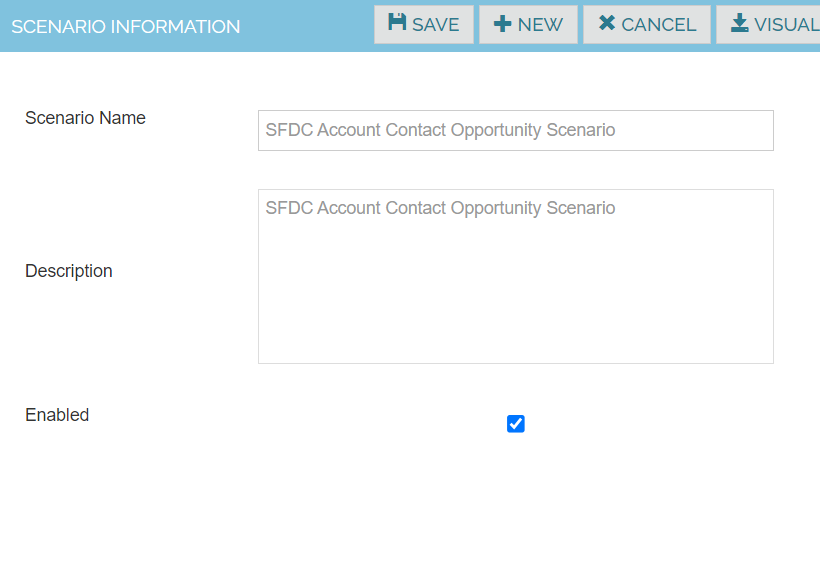
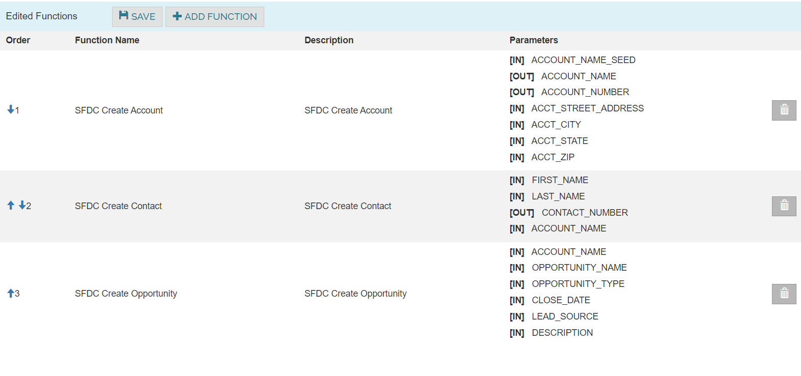
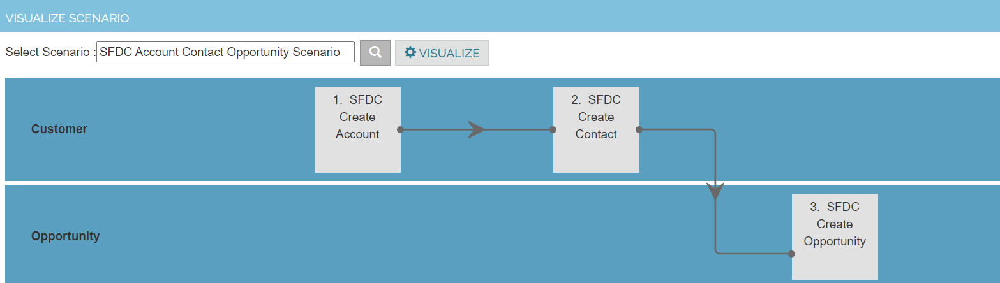

Scenario

Create Test Scenarios by assembling the Test Functions in the order of execution

1. Navigate to Configuration -> Scenarios
2. Click Create new Scenario
3. Enter the Scenario name , description and the below details 
4. Click on save button

| Scenario Name            |SFDC Create Account, Contact, and Opportunity|
|--------------------------|--------------------------------------       |
|Description               |SFDC Create Account, Contact, and Opportunity|

Click Add Function and Enter the below details. Save the Work

Click on Visualize Scenario

