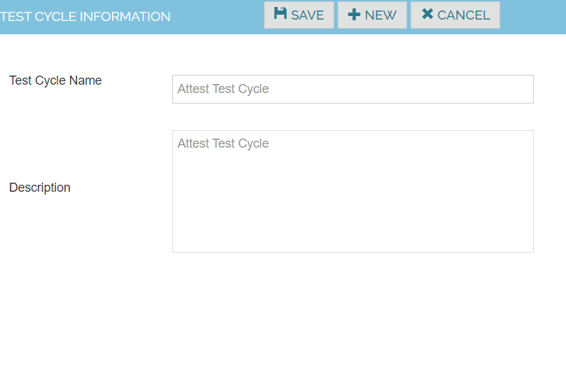

Test Cycle

Create Test Cycles corresponding to the test cycles used for testing the application.

1. Navigate to Execute -> Test Cycles 
2. Click on  Create New Test Cycle 
3. Enter the test cycle name and description name
4. Click on save button

|Test Cycle Name	|Attest Test Cycle|
|------------------ |---------------- |
|Description	    |Attest Test Cycle|

