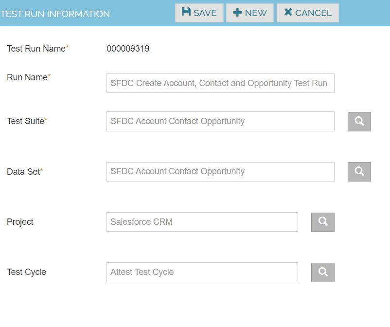
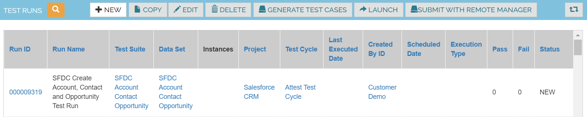
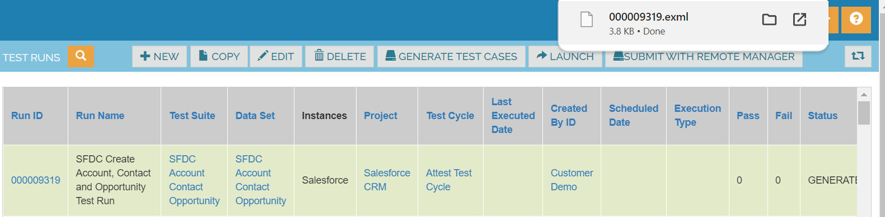
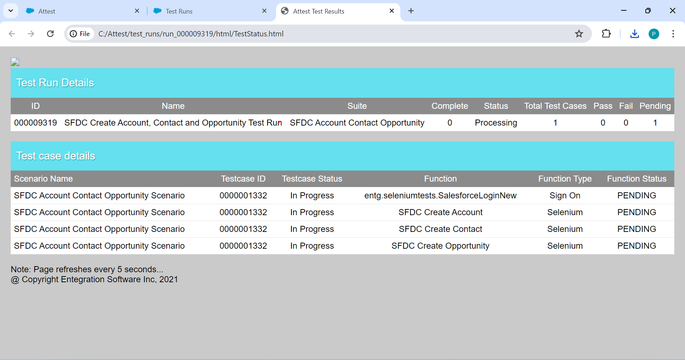

Test Runs

Create Test Runs by picking the Test Suites and the corresponding Datasets for testing

1. Navigate to Execute -> Test Runs 
2. Click on Create New Test Run
3. Enter the Run name ,testsuite, dataset, project and testcycle details 
4. Click on Save button

| Run Name                                      | SFDC Create Account, Contact and Opportunity Test Run |
|----------------------------------------------|------------------------------------------------------|
| Test Suite                                    | SFDC Create Account, Contact and Opportunity TS       |
| Data Set                                      | SFDC Create Account, Contact and Opportunity Dataset |
| Project                                       | Salesforce CRM                                       |
| Test Cycle                                    | Attest Test Cycle                                    |

After Save action, Test Run id will be generated.

**Steps to Execute the Test Runs**
Place the Cursor on specific Test Run Id and click on “Generate Test Cases” button

Click on Submit
Click on Launch Button and Click on Download “000009319.exml” .

Web Page opened which shows Test Run Details and Test case details are in Pending Status

