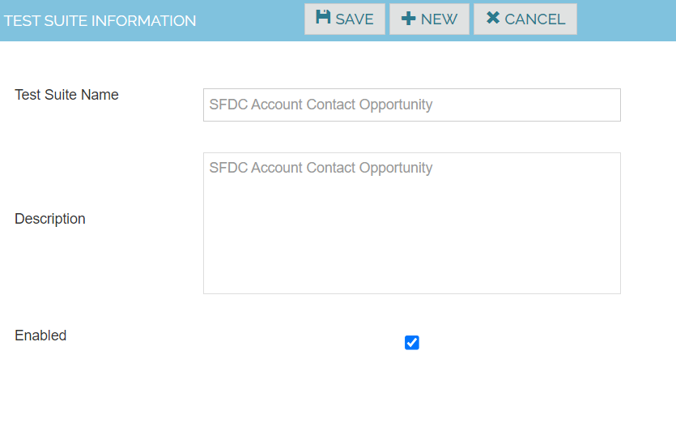
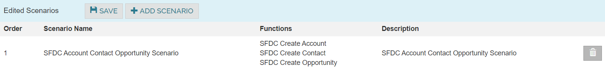

Testsuite

Create Test Suites by assembling Test Scenarios in the order of execution

1. Navigate to Configuration -> Test Suites 
2. Click on Create New Test Suite Information
3. Enter the Testsuite name , description and the below details
4. Click on Save button

| Testsuite Name            | SFDC Create Account Contact and Opportunity |
|--------------------------|--------------------------------------         |
| Description              | SFDC Create Account Contact and Opportunity |

Click Add Scenario and Enter the below details. Save the Work.

|Order	|  Scenario Name                               | 
|--------------------------|---------------------------|
| 1	    | SFDC Create Account, Contact and Opportunity |

