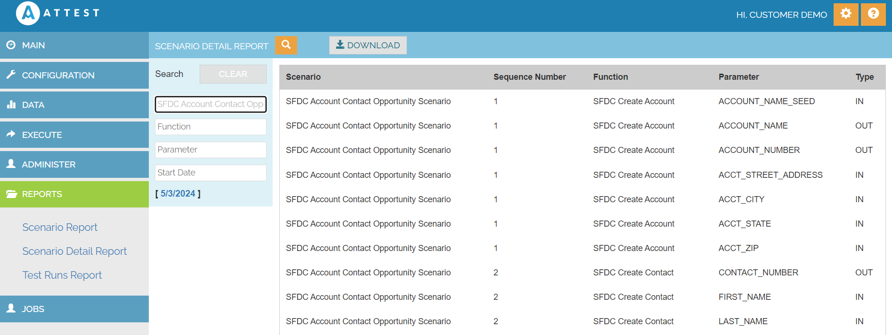

Scenario Details Report

Scenario Detail Report gives the Function ,parameters and its type details of the Scenario

1. Navigate to Reports
2. Click Scenario Detail Report
3. Click on the search button
4. Enter Scenario name 
5. It will displays the scenario ,Function ,Parameters and its type details.

| Scenario Name    | SFDC Account Contact Opportunity Scenario |
|---------------   |----------|

