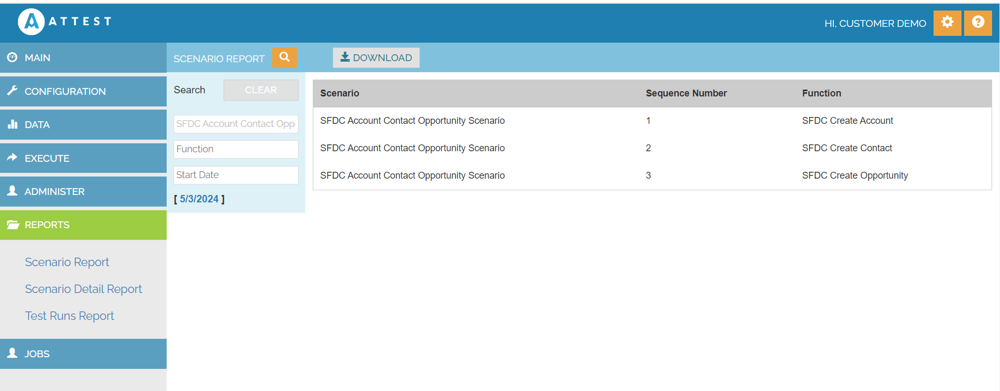

Scenario Report

Scenario Report gives the Function level details of the Scenario

1. Navigate to Reports
2. Click Scenario Report
3. Click on the search button
4. Enter Scenario name
5. It will displays the scenario and Function details

| Scenario Name    | SFDC Account Contact Opportunity Scenario |
|---------------   |----------|

